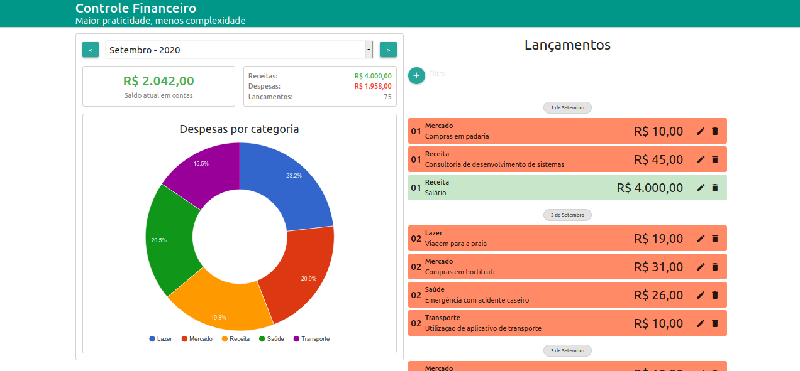

<h2 align="center" >Personal Financial Control APP</h2>

  <p align="center">
  <a href="https://linkedin.com/in/danielnunesdc">
    
    
    
    
  </a>
</p>

  <p align="center">The challenge is to develop a web application for Personal Financial Control, with NodeJs and Express technologies to create API, MongoDB and Mongoose to persist data, React on the frontend consuming the developed API, and finally publish on Heroku.</p>

**Functionalities:**

- Filter entries by period.
- Filter by description.
- Add, edit and remove entries.

#### App




#### Run

**Requirements: Node + Yarn**

```bash
# Node Version
$ node -v
v12.18.3

$ yarn -v
1.22.5
```

Backend

```bash
# Clone the repository
$ git clone https://github.com/nunesdaniel/Personal-Financial-Control-App.git

# Enter the directory
$ cd app

# Install back-end dependencies
$ yarn

# Start the server
$ yarn server
```

Frontend

```bash
# Enter the front-end directory
$ cd finapp/client

# Install front-end dependencies
$ yarn

# Start the Front-end
$ yarn start
```

For more details use the Development Guide.

#### Technologies and libraries:

- [NodeJs](https://nodejs.org/)
- [ReactJs](https://reactjs.org/)
- [MongoDB Atlas](https://www.mongodb.com/)
- [Heroku](https://www.heroku.com/)

#### How to contribute

If you want to contribute to this repository, either by correcting any problems, adding comments or improving the documentation, you can follow this tutorial below:

- Fork this repository;
- Go to your GitHub profile and make a clone of the repository;
- Create a branch with your change: `git checkout -b my-change`;
- Make any necessary changes to the code or documentation;
- Commit your changes: `git commit -m 'feat: My new feature'`;
- Push to your branch: `git push origin my-change`;
- Now just open your Pull Request;

#### Get in touch!

<p align="left">
 <a href="mailto:danielnunesdev@gmail.com" target="blank"></a>
  
<a href="https://linkedin.com/in/danielnunesdc" target="blank"></a>
</p><br />

#### License

This project is under the MIT license. For more details visit [LICENSE](LICENSE.md).

---

Made with :coffee: and ♥ by Daniel Nunes :wave:
